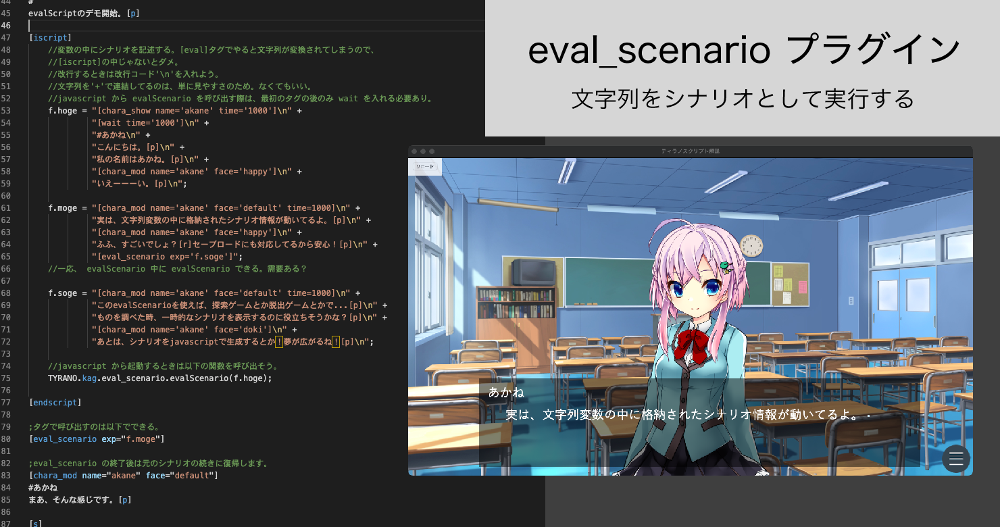

# eval_scenario プラグイン



ティラノスクリプト用のプラグイン。

このプラグインは、文字列変数内に記述されたシナリオを解析して実行する[eval_scenario]タグをティラノスクリプトに追加します。セーブ・ロードにも対応しています。また、eval_scenario 専用のボタン系タグも追加されます。

例えば、以下のような場合に便利です。

-   シナリオを javascript 上で生成し、実行する。
-   探索ゲーム、脱出ゲームなどで、ものを調べた際にちょっとしたシナリオを発生させる。

eval_scenario の終了後は、元のシナリオに続きに復帰します。

## 更新履歴

2022/03/28 eval_scenario 中に eval_scenario した際の不具合を修正しました。

2022/03/27 サンプルゲームを追加しました。

2022/03/26 タグを追加しました。

## デモ

https://www.youtube.com/watch?v=droNDtFYdyc

## サンプルゲーム

"es_samplegame"フォルダの中身は、eval_scenario プラグインを利用したサンプルゲームです。（デモ動画とは違うものです）

↓ サンプルゲーム動画

https://www.youtube.com/watch?v=bFivL_YD0X8

↓ サンプルゲームに関する記事（大したことはない）

https://note.com/9min_packup/n/n01f7f2ca7b43

## 解説記事

https://note.com/9min_packup/n/nd7b1f99a059e

## 導入

1. このリポジトリをダウンロードします。（右上の[code]ボタン->[Download Zip] で）
2. Zip を解凍します。
3. 解凍したフォルダ内の"eval_scenario"フォルダを、あなたのティラノスクリプトプロジェクトの"data/others/plugin/"以下にコピーします。
4. "first.ks" 内に以下を記述します。

```
[plugin name="eval_scenario"]
```

以上で導入完了です。

※ "make.ks"に何かを記述する必要はありません。

## 使い方

例えば、以下のように記載します。

```
[iscript]
    f.hoge = "[chara_show name='akane' time='1000']\n" +
             "#あかね\n" +
             "こんにちは。[p]\n" +
             "私の名前はあかね。[p]\n" +
             "[chara_mod name='akane' face='happy']\n" +
             "いえーーーい。[p]\n";
[endscript]

[eval_scenario exp="f.hoge"]

```

-   変数の中にシナリオを記述した文字列を代入してください。[eval]タグで行うと文字列が変換されてしまうので、
    [iscript]の中で記述する必要があります。
-   改行するときは改行コード'\n'を入れます。
-   文字列を'+'で連結してるのは、単に見やすさのためで、なくてもいいです。

また、以下のように、[iscript]内で直接実行することもできます。この場合、最初のタグの後ろのみ[wait]をいれてください。

```
[iscript]
    f.hoge = "[chara_show name='akane' time='1000']\n" +
             "[wait time='1000']" +
             "#あかね\n" +
             "こんにちは。[p]\n" +
             "私の名前はあかね。[p]\n" +
             "[chara_mod name='akane' face='happy']\n" +
             "いえーーーい。[p]\n";

    TYRANO.kag.eval_scenario.evalScenario(f.hoge);
[endscript]
```

余談ですが、[iscript]内で直接実行する際は、変数に代入せずにそのまま文字列を引数に渡しても大丈夫です。

```
[iscript]
    TYRANO.kag.eval_scenario.evalScenario(
             "[chara_show name='akane' time='1000']\n" +
             "[wait time='1000']" +
             "#あかね\n" +
             "こんにちは。[p]\n" +
             "私の名前はあかね。[p]\n" +
             "[chara_mod name='akane' face='happy']\n" +
             "いえーーーい。[p]\n"
        );
[endscript]
```

## タグ

### [eval_scenario]

文字列変数内に記述されたシナリオを解析して実行します。

使用できるパラメータ：

-   exp : 解析する文字列変数を指定します。
-   storage : 復帰後に遷移する ks ファイルを指定します。指定がなければ呼び出し元の ks ファイルとなります。
-   target : 復帰後に遷移するラベルを指定します。指定がなければ呼び出し元の次のタグに遷移します。

### [es_jump]

実行中の eval_scenario を中断して jump します。
eval_scenario 内では通常の jump タグを使用できない（使用するとバグる）ため、こちらを使用してください。

使用できるパラメータ：

-   storage : 遷移する ks ファイルを指定します。指定がなければ eval 中のシナリオを指します。
-   target : 遷移するラベルを指定します。指定がなければシナリオの先頭に遷移します。

### [es_button]

button の eval_scenario バージョンです。ボタンを押すと exp に指定した文字列を eval_scenario します。fix 指定もできます。
role, savesnap パラメータは存在しません。

使用できるパラメータ：

-   exp : 解析する文字列変数を指定します。
-   storage : 復帰後に遷移する ks ファイルを指定します。指定がなければ呼び出し元の ks ファイルとなります。
-   target : 復帰後に遷移するラベルを指定します。指定がなければ呼び出し元の次のタグに遷移します。
-   その他使用できるパラメータは button と同じです。

### [es_glink]

glink の eval_scenario バージョンです。ボタンを押すと exp に指定した文字列を eval_scenario します。

使用できるパラメータ：

-   exp : 解析する文字列変数を指定します。
-   storage : 復帰後に遷移する ks ファイルを指定します。指定がなければ呼び出し元の ks ファイルとなります。
-   target : 復帰後に遷移するラベルを指定します。指定がなければ呼び出し元の次のタグに遷移します。
-   その他使用できるパラメータは glink と同じです。

### [es_clickable]

clickable の eval_scenario バージョンです。clickable と異なり、exp パラメータが追加されています。
指定した範囲を押すと exp に指定した文字列を eval_scenario します。

使用できるパラメータ：

-   exp : 解析する文字列変数を指定します。
-   storage : 復帰後に遷移する ks ファイルを指定します。指定がなければ呼び出し元の ks ファイルとなります。
-   target : 復帰後に遷移するラベルを指定します。指定がなければ呼び出し元の次のタグに遷移します。
-   その他使用できるパラメータは clickable と同じです。

※ボタン系のタグは、[s]タグで止めると押せるようになります。（この挙動は通常のボタンと同じ）。しかし、eval_scenario が終了した後は、この[s]タグの次のタグから再開されることに注意してください。(そういう仕様です。)

## ライセンス

MIT License

## コピーライト

Copyright 2022 箱詰九分 (@9min_packup)
